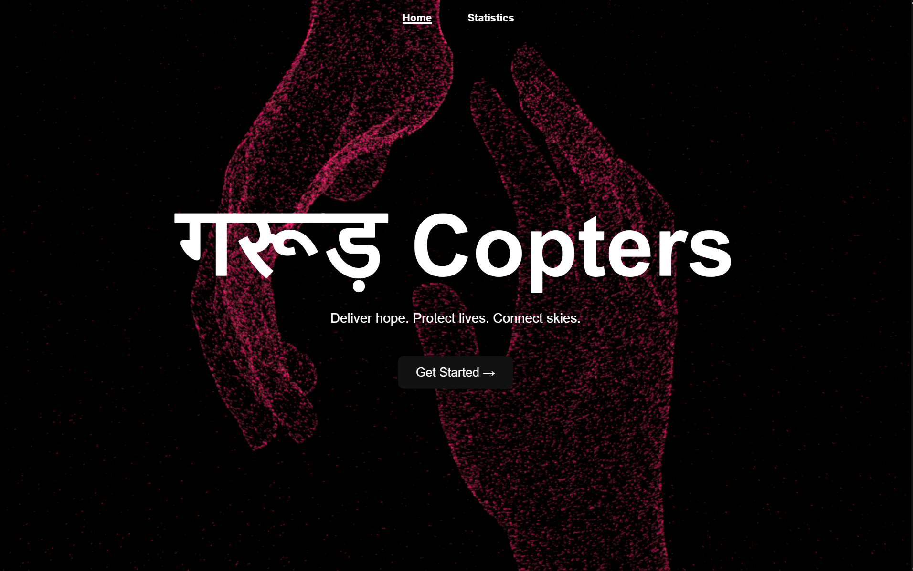
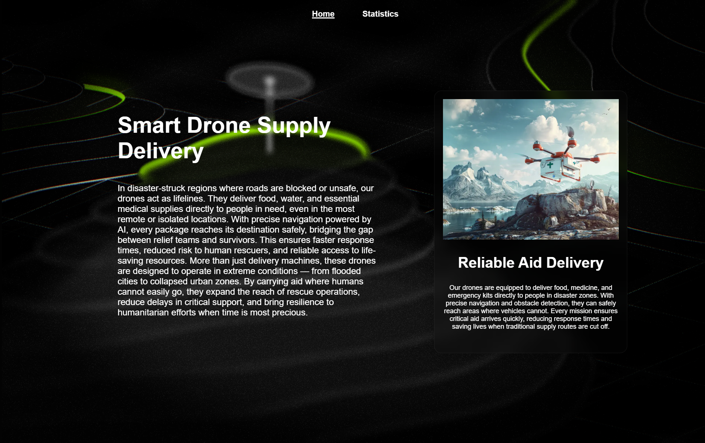
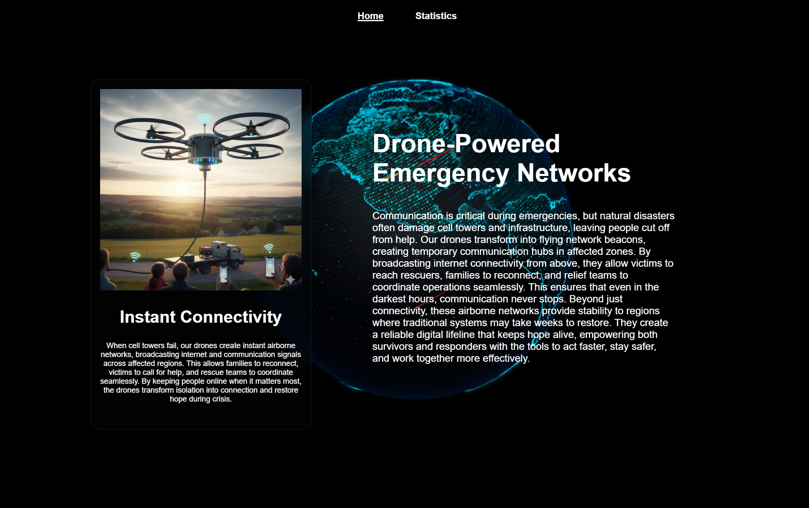
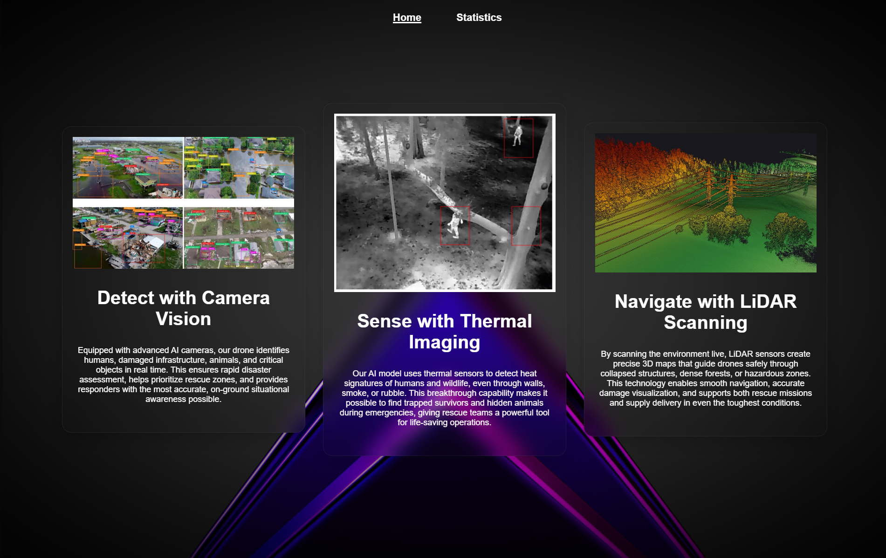
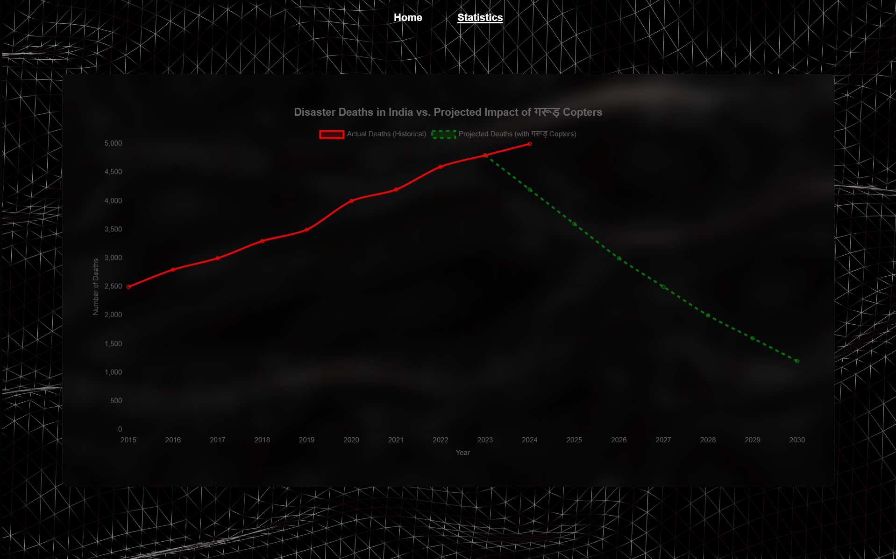

<h1 align="center">🚁 Drone_DM Client</h1>

<p align="center">
  <strong>A modern 3D Animated Disaster Management Web Application built with React, Vite and Spline.</strong>
</p>

<p align="center">
  
  
  
  
  
  
</p>

---

# 📸 Screenshots

<p align="center">
  
  
</p>

<p align="center">
  
  
</p>

<p align="center">
  
</p>

---

# 🎥 Demo

**Coming Soon**

(Coming Soon)

---

# 📖 Overview

Drone_DM Client is a modern disaster management frontend designed to provide an engaging and immersive user experience through interactive 3D graphics, responsive layouts, and rich visualizations.

Unlike traditional dashboards, this application focuses on visual storytelling by combining Spline-powered animations with React components and interactive charts. The result is a clean, modern interface that makes disaster-related information more intuitive and visually appealing.

This repo now also holds **Garud Copters CV**, a Python computer-vision + agentic AI backend that turns aerial/drone footage into structured incident data this frontend can consume — see below.

---

# 🛰️ Garud Copters CV (ML / Computer Vision Backend)

`cv-backend/` is a disaster-response object detection system: a YOLOv8 model
fine-tuned to spot **people** and **vehicles** in aerial/disaster imagery,
served over a FastAPI backend, containerized with Docker, with a LangGraph
agentic layer on top that turns raw detections into a severity assessment
and a plain-language incident report.

- **Detect**: `POST /detect/image` and `POST /detect/video` — per-object
  detections or a frame-sampled aggregate summary
- **Reason**: `POST /report` runs a LangGraph agent (rule-based severity +
  Claude-written summary + a recommended next action — "dispatch rescue
  team" vs "continue monitoring")
- **Full docs**: [`cv-backend/README.md`](cv-backend/README.md) — architecture,
  the real dataset used (with license, verified on Roboflow Universe), actual
  training results, and how to run everything locally
- **Dataset provenance**: [`cv-backend/DATASET.md`](cv-backend/DATASET.md)

```bash
cd cv-backend
python3 -m venv .venv && source .venv/bin/activate
pip install -r requirements.txt
uvicorn app.main:app --reload --port 8000
```

---

# ✨ Features

- 🌍 Modern Responsive Interface
- 🎨 Interactive 3D Landing Page
- ⚡ Powered by Vite
- 📊 Interactive Charts using Chart.js
- 🧩 Reusable React Components
- 🛣 React Router Navigation
- 📱 Fully Responsive Design
- 🚀 Optimized Performance
- 🧼 Clean Project Structure

---

# 🎮 Spline Integration

The landing page uses **Spline** to deliver an interactive 3D experience.

### Libraries Used

- @splinetool/react-spline
- @splinetool/runtime

### Included Components

- **SplineBanner**
  - Interactive 3D scene

- **SplineBannerNoMouse**
  - Static version without mouse interaction

These components provide an engaging first impression while keeping the code modular and reusable.

---

# 📊 Charts

Disaster statistics are visualized using:

- Chart.js
- React Chart.js 2

Features include:

- Responsive Charts
- Animated Rendering
- Interactive Legends
- Easily Extendable Datasets

---

# 🛠 Tech Stack

### Frontend (`src/`)

| Technology | Purpose |
|------------|---------|
| React 19 | Frontend Framework |
| Vite 6 | Build Tool |
| React Router DOM | Routing |
| Chart.js | Data Visualization |
| React Chart.js 2 | React Wrapper |
| Spline Runtime | 3D Rendering |
| React Spline | Spline Integration |
| ESLint | Code Quality |

### CV / ML Backend (`cv-backend/`)

| Technology | Purpose |
|------------|---------|
| YOLOv8 (Ultralytics) | Object detection, fine-tuned via transfer learning |
| PyTorch | Underlying deep learning framework |
| OpenCV | Video I/O, frame drawing, centroid tracking |
| FastAPI | HTTP serving layer |
| LangGraph | Agentic severity-assessment + report pipeline |
| Roboflow | Dataset hosting/versioning + Python SDK |
| Docker | Containerized deployment |

---

# 📂 Folder Structure

```text
.
├── src                       # React frontend (this Vite app)
│   ├── assets
│   ├── components
│   │   ├── DisasterDeathsChart
│   │   ├── SplineBanner
│   │   ├── SplineBannerNoMouse
│   │   └── ...
│   ├── layouts
│   │   ├── header
│   │   └── footer
│   ├── pages
│   │   ├── home
│   │   └── statistics
│   ├── routes
│   ├── App.jsx
│   ├── main.jsx
│   └── index.css
│
└── cv-backend                # Garud Copters CV — Python ML/CV backend
    ├── DATASET.md             # dataset provenance, license, honesty note
    ├── README.md               # full backend docs
    ├── data/                    # real dataset target (placeholder until populated)
    ├── scripts/                  # dataset download + smoke-test generator
    ├── train.py                   # YOLOv8 fine-tuning
    ├── inference.py                 # OpenCV image/video/webcam pipeline
    ├── app/                          # FastAPI app + LangGraph agent
    ├── models/best.pt                 # trained checkpoint
    ├── metrics.json                    # real training run output
    └── Dockerfile / docker-compose.yml
```

---

# 🚀 Installation

## Clone Repository

```bash
git clone https://github.com/yourusername/Drone_DM_Client.git
```

```bash
cd Drone_DM_Client
```

## Install Dependencies

```bash
npm install
```

## Start Development Server

```bash
npm run dev
```

Visit

```
http://localhost:5173
```

## Build Project

```bash
npm run build
```

## Preview Build

```bash
npm run preview
```

---

# 📜 Available Scripts

| Command | Description |
|----------|-------------|
| npm run dev | Start Development Server |
| npm run build | Build Production Files |
| npm run preview | Preview Production Build |
| npm run lint | Run ESLint |

---

# 📦 Libraries

### React

Component-based frontend library used to build the application's user interface.

### Vite

Fast development server and production build tool.

### React Router DOM

Provides client-side routing without page reloads.

### Chart.js

Creates interactive and animated charts.

### React Chart.js 2

Official React wrapper for Chart.js.

### @splinetool/react-spline

Embeds Spline scenes inside React.

### @splinetool/runtime

Runs exported Spline scenes.

### ESLint

Maintains consistent code quality and formatting.

---

# 🌟 Future Improvements

- Wire the frontend up to `cv-backend`'s `/detect/*` and `/report` endpoints (currently standalone)
- Debris detection (see `cv-backend/DATASET.md` — reserved class, not yet trained)
- Authentication
- User Dashboard
- GIS Mapping
- Dark Theme
- Real-time Updates
- Notification System
- Performance Optimization
- Deployment Pipeline

---

# 🤝 Contributing

Contributions are welcome.

1. Fork this repository

2. Create a feature branch

```bash
git checkout -b feature-name
```

3. Commit your changes

```bash
git commit -m "Add feature"
```

4. Push your branch

```bash
git push origin feature-name
```

5. Open a Pull Request

---

# 📄 License

This project is intended for educational and research purposes.

---

<p align="center">
Made with ❤️ using React, Vite and Spline
</p>
